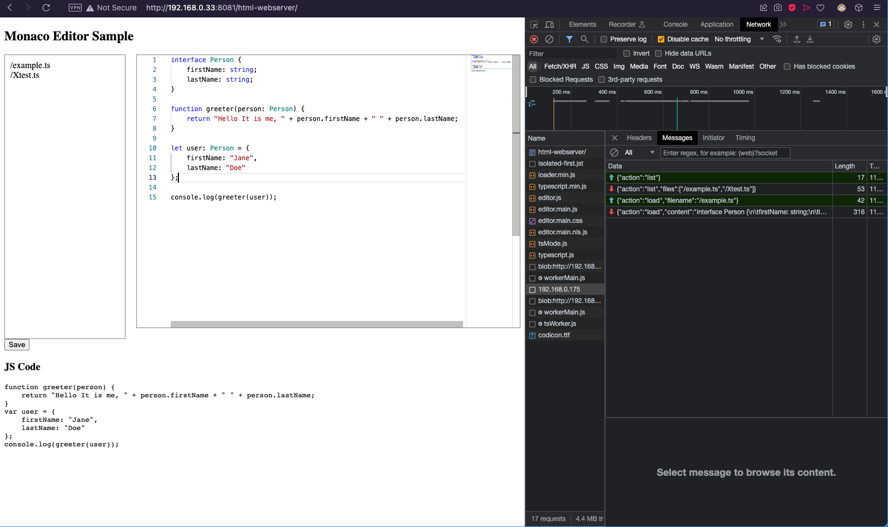

# ESP32-monaco-editor-spiffs

This is the example that is possible to create VSCode like editor on ESP32 based on [Monaco](https://microsoft.github.io/monaco-editor/) editor.



```bash
Connecting to WiFi...
Connected to WiFi
IP address: 192.168.0.175
SPIFFS mounted
{"action":"list","files":["/example.ts","/Xtest.ts"]}
Opening file: /Xtest.ts
{"action":"load","content":"console.log(\"Hi there!\");\n"}
```

## How to use

- Build firmware and upload them to the ESP32 - use PIO
- Upload `arduino-webserver` -> `data/` using `pio run -t uploadfs`
- Open `html-webserver` -> `index.html` in browser (or serv them locally - `http-server ./` ) and connect to the ESP32 (have to be configured WS address - `webSocketAddress`)

## Known issues

- server does not serve the editor page page - will be added later (or you can do it and create PR)
- `html-webserver` that contains `Monaco editor` and `TS Compiler` is smaller than 4 MB - it will be possible to save them in `SPIFFS` on ESP32.